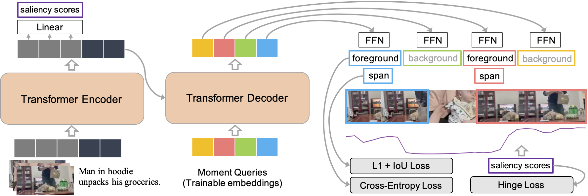

# Moment-DETR

[QVHighlights: Detecting Moments and Highlights in Videos via Natural Language Queries](https://arxiv.org/abs/2107.09609), NeurIPS 2021

[Jie Lei](http://www.cs.unc.edu/~jielei/), 
[Tamara L. Berg](http://tamaraberg.com/), [Mohit Bansal](http://www.cs.unc.edu/~mbansal/)

This repo contains a copy of QVHighlights dataset for moment retrieval and highlight detections. For details, please check [data/README.md](data/README.md)
This repo also hosts the Moment-DETR model (see overview below), a new model that predicts moment coordinates and saliency scores end-to-end based on a given text query. This released code supports pre-training, fine-tuning, and evaluation of Moment-DETR on the QVHighlights datasets. It also supports running prediction on your own raw videos and text queries. 





## Table of Contents

* [Getting Started](#getting-started)
    * [Prerequisites](#prerequisites)
    * [Training](#training)
    * [Inference](#inference)
    * [Pretraining and Finetuning](#pretraining-and-finetuning)
    * [Evaluation and Codalab Submission](#evaluation-and-codalab-submission)
    * [Train Moment-DETR on your own dataset](#train-moment-detr-on-your-own-dataset)
* [Demo: Run predictions on your own videos and queries](#run-predictions-on-your-own-videos-and-queries)
* [Acknowledgement](#acknowledgement)
* [LICENSE](#license)


## Getting Started 

### Prerequisites
0. Clone this repo

```
git clone https://github.com/jayleicn/moment_detr.git
cd moment_detr
```

1. Prepare feature files

Download [moment_detr_features.tar.gz](https://drive.google.com/file/d/1Hiln02F1NEpoW8-iPZurRyi-47-W2_B9/view?usp=sharing) (8GB), 
extract it under project root directory:
```
tar -xf path/to/moment_detr_features.tar.gz
```
The features are extracted using Linjie's [HERO_Video_Feature_Extractor](https://github.com/linjieli222/HERO_Video_Feature_Extractor).

2. Install dependencies.

This code requires Python 3.7, PyTorch, and a few other Python libraries. 
We recommend creating conda environment and installing all the dependencies as follows:
```
# create conda env
conda create --name moment_detr python=3.7
# activate env
conda actiavte moment_detr
# install pytorch with CUDA 11.0
conda install pytorch torchvision torchaudio cudatoolkit=11.0 -c pytorch
# install other python packages
pip install tqdm ipython easydict tensorboard tabulate scikit-learn pandas h5py
```
The PyTorch version we tested is `1.9.0`.

### Training

Training can be launched by running the following command:
```
bash moment_detr/scripts/train.sh 
```
This will train Moment-DETR for 200 epochs on the QVHighlights train split, with SlowFast and Open AI CLIP features. The training is very fast, it can be done within 4 hours using a single RTX 2080Ti GPU. The checkpoints and other experiment log files will be written into `results`. For training under different settings, you can append additional command line flags to the command above. For example, if you want to train the model without the saliency loss (by setting the corresponding loss weight to 0):
```
bash moment_detr/scripts/train.sh --lw_saliency 0
```
For more configurable options, please checkout our config file [moment_detr/config.py](moment_detr/config.py).

### Inference
Once the model is trained, you can use the following command for inference:
```
bash moment_detr/scripts/inference.sh CHECKPOINT_PATH SPLIT_NAME  
``` 
where `CHECKPOINT_PATH` is the path to the saved checkpoint, `SPLIT_NAME` is the split name for inference, can be one of `val` and `test`.

### Pretraining and Finetuning
Moment-DETR utilizes ASR captions for weakly supervised pretraining. To launch pretraining, run:
```
bash moment_detr/scripts/pretrain.sh 
```  
This will pretrain the Moment-DETR model on the ASR captions for 100 epochs, the pretrained checkpoints and other experiment log files will be written into `results`. With the pretrained checkpoint, we can launch finetuning from a pretrained checkpoint `PRETRAIN_CHECKPOINT_PATH` as:
```
bash moment_detr/scripts/train.sh  --resume ${PRETRAIN_CHECKPOINT_PATH}
```
Note that this finetuning process is the same as standard training except that it initializes weights from a pretrained checkpoint. 


### Evaluation and Codalab Submission
Please check [standalone_eval/README.md](standalone_eval/README.md) for details.


### Train Moment-DETR on your own dataset
To train Moment-DETR on your own dataset, please prepare your dataset annotations following the format 
of QVHighlights annotations in [data](./data), and extract features using [HERO_Video_Feature_Extractor](https://github.com/linjieli222/HERO_Video_Feature_Extractor).
Next copy the script [moment_detr/scripts/train.sh](./moment_detr/scripts/train.sh) and modify the dataset specific parameters 
such as annotation and feature paths. Now you are ready to use this script for training as described in [Training](#training).


## Run predictions on your own videos and queries
You may also want to run Moment-DETR model on your own videos and queries. 
First you need to add a few libraries for feature extraction to your environment. Before this, you should have already installed PyTorch and other libraries for running Moment-DETR following instuctions in previous sections.
```bash
pip install ffmpeg-python ftfy regex
```
Next, run the example provided in this repo:
```bash
PYTHONPATH=$PYTHONPATH:. python run_on_video/run.py
```
This will load the Moment-DETR model [checkpoint](run_on_video/moment_detr_ckpt/model_best.ckpt) trained with CLIP image and text features, and make predictions for the video [RoripwjYFp8_60.0_210.0.mp4](run_on_video/example/RoripwjYFp8_60.0_210.0.mp4) with its associated query in [run_on_video/example/queries.jsonl](run_on_video/example/queries.jsonl).
The output will look like the following:
```
Build models...
Loading feature extractors...
Loading CLIP models
Loading trained Moment-DETR model...
Run prediction...
------------------------------idx0
>> query: Chef makes pizza and cuts it up.
>> video_path: run_on_video/example/RoripwjYFp8_60.0_210.0.mp4
>> GT moments: [[106, 122]]
>> Predicted moments ([start_in_seconds, end_in_seconds, score]): [
    [49.967, 64.9129, 0.9421], 
    [66.4396, 81.0731, 0.9271], 
    [105.9434, 122.0372, 0.9234], 
    [93.2057, 103.3713, 0.2222], 
    ..., 
    [45.3834, 52.2183, 0.0005]
   ]
>> GT saliency scores (only localized 2-sec clips): 
    [[2, 3, 3], [2, 3, 3], ...]
>> Predicted saliency scores (for all 2-sec clip): 
    [-0.9258, -0.8115, -0.7598, ..., 0.0739, 0.1068]   
```
You can see the 3rd ranked moment `[105.9434, 122.0372]` matches quite well with the ground truth of `[106, 122]`, with a confidence score of `0.9234`.
You may want to refer to [data/README.md](data/README.md) for more info about how the ground-truth is organized.
Your predictions might slightly differ from the predictions here, depends on your environment.

To run predictions on your own videos and queries, please take a look at the `run_example` function inside the [run_on_video/run.py](run_on_video/run.py) file.


## Acknowledgement
We thank [Linjie Li](https://scholar.google.com/citations?user=WR875gYAAAAJ&hl=en) for the helpful discussions.
This code is based on [detr](https://github.com/facebookresearch/detr) and [TVRetrieval XML](https://github.com/jayleicn/TVRetrieval). We used resources from [mdetr](https://github.com/ashkamath/mdetr), [MMAction2](https://github.com/open-mmlab/mmaction2), [CLIP](https://github.com/openai/CLIP), [SlowFast](https://github.com/facebookresearch/SlowFast) and [HERO_Video_Feature_Extractor](https://github.com/linjieli222/HERO_Video_Feature_Extractor). We thank the authors for their awesome open-source contributions. 

## LICENSE
The annotation files are under [CC BY-NC-SA 4.0](https://creativecommons.org/licenses/by-nc-sa/4.0/) license, see [./data/LICENSE](data/LICENSE). All the code are under [MIT](https://opensource.org/licenses/MIT) license, see [LICENSE](./LICENSE).
 
